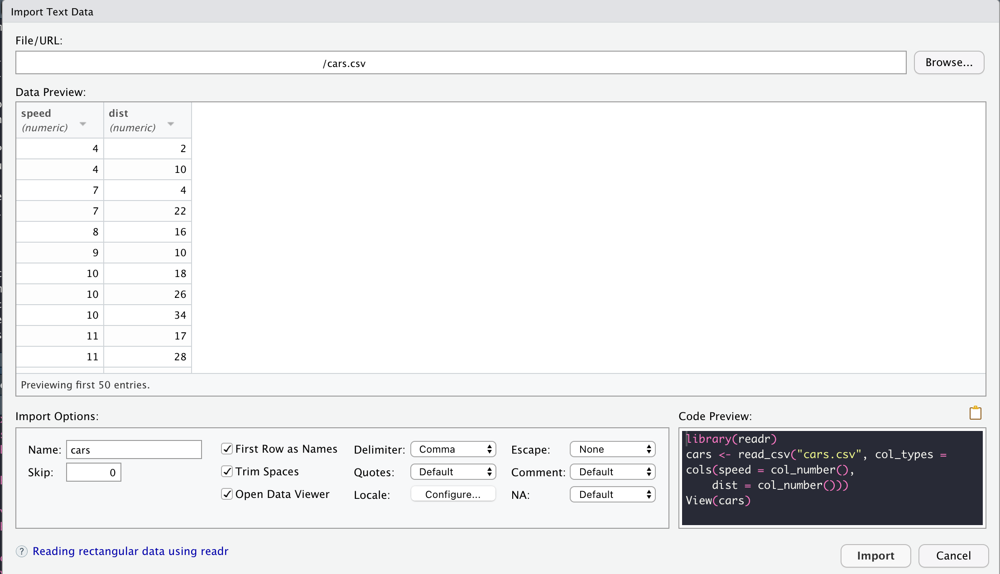

# Importar Datos a R
Uno de los primeros pasos para la realización de una investigación o estudio es la importación de datos. En R tenemos diferentes alternativas para hacer esto y varían con respecto al tipo de archivo donde tengamos la data.

A continuación estaremos viendo algunas formas de importar data de diferentes archivos.

## Point and Click
RStudio permite importar diferentes archivos utilizando ventanas de dialogo, lo que facilita este proceso. Al seleccionar File > Import Dataset aparece diferentes opciones para importar archivos. En esta ocasión estaremos cubriendo la importación de archivos planos (txt, csv) y archivos de Excel (xlsx).

### Archivos planos
Los archivos planos son un conjunto de datos de texto sin formato. Frecuentemente la información es compartida en archivos .txt y .csv. RStudio permite realizar la importación de estos archivos utilizando la opción de "From Text (base)" o "From Text (readr)". Al seleccionar cualquiera de estas opciones tenemos un cuadro de diálogo que nos presenta diferentes opciones de personalización para cada archivo que queremos importar.

Aparte de su fácil acceso, en uno de los panles de esta ventana pondemos encontrar el código necesario para la importación de datos. Podemos copiar este código y agregarlo a nuestro script y así se puede automatizar este paso.

<p align="center">
  
</p>

A continuación se presenta el código necesario para importar un archivo en .csv y un .txt separado por tabs. En ambos casos especificamos el tipo de dato (integer) para ambas variables. Esto es un paso que, aunque parece trivial, puede ayudarnos para una siguiente etapa: la manipulación y exploración de datos.

```
# .csv
cars <- read_csv("cars.csv", 
                 col_types = cols(speed = col_integer(),
                                  dist = col_integer()))
# .txt
cars <- read_delim("cars.txt",
                   delim = "\t", 
                   escape_double = FALSE, 
                   col_types = cols(speed = col_integer(),
                                    dist = col_integer()),
                   trim_ws = TRUE)
```

### Archivos de Excel
Dado la popularidad que tiene este programa, Excel se ha convertido en una de las formas predilectas para guardar información. De manera similar, RStudio ofrece una ventana donde podemos customizar la importación de archivos de Excel y obtener el código relacionado con este proceso.

```
# .xlsx
cars <- read_excel("cars.xlsx", 
                   col_types = c("numeric", 
                                 "numeric"))
```

## Conclusión
Siendo la importación de datos unos de los primeros pasos para cualquier análisis, es muy importante hacerlo correctamente. RStudio tiene la ventaja de proveer algunas ventanas de diálogo que nos permiten buscar, ajustar y revisar la data antes de importarla. Al mismo tiempo, en la misma ventana tenemos el código necesario para automatizar este paso.

